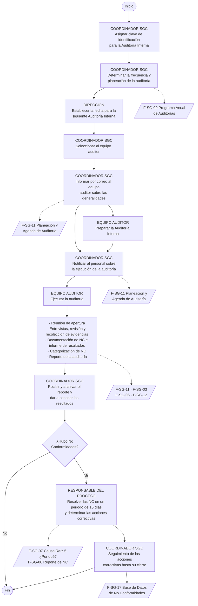

# P-SG-03 · Procedimiento para Auditorías Internas

> Transcripción del `.docx` que entregó Summit (30 ago 2026). Versión vigente 0,
> emitido el 10-Feb-2025. Elaboró: Coordinador de SGC · Revisó y aprobó: Dirección.
>
> **Es el documento que manda sobre los otros tres formatos.** F-SG-11, F-SG-06 y
> F-SG-12 son sus salidas; aquí está el porqué de cada uno y en qué orden se
> llenan. Escrito para GRUPO ATELIER contra ISO 9001:2015 — ver la advertencia de
> generalización en el [README](README.md).

---

## 1 · Objetivo

Establecer los lineamientos para la planificación y desarrollo de auditorías
internas, que permitan verificar si las actividades y resultados del Sistema de
Gestión han sido eficazmente implantados.

## 2 · Alcance

Aplica a los procesos que forman parte del sistema de gestión, evaluando su
conformidad, implantación y efectividad e identificando oportunidades de mejora.

## 3 · Definiciones — ⚠️ **esto es `D02`**

Las tres definiciones marcadas son el criterio de clasificación de la firma. Es
lo que hace que dos auditores clasifiquen igual, y va **dentro de la app** como
ayuda contextual al elegir el tipo de un hallazgo.

- **Auditoría:** proceso sistemático, independiente y documentado para obtener
  evidencias y evaluarlas de manera objetiva con el fin de determinar la
  extensión en que se cumplen los criterios definidos.
- **Criterios de auditoría:** conjunto de políticas, procedimientos o requisitos
  que se utilizan como referencia frente a la cual se comparan las evidencias.
- **Auditoría interna:** la efectuada para verificar y evaluar el cumplimiento,
  la implantación y la efectividad del sistema, así como la necesidad de mejoras.
- **Evidencia objetiva:** registros, declaraciones o hechos pertinentes a los
  criterios de la auditoría, **que pueden ser probados**.
- **Hallazgos de la auditoría:** resultados de la evaluación de la evidencia
  recopilada frente a los criterios.
- ⚠️ **No conformidad:** incumplimiento de al menos un requisito especificado; la
  desviación o ausencia de una o más características del sistema, incluyendo
  aquellas de seguridad de funcionamiento.
- ⚠️ **No conformidad MAYOR:** si afecta el funcionamiento de al menos un
  requisito **completo** del sistema, la calidad del servicio, **o** es un
  requisito normativo/regulatorio que no se cumple **en su totalidad**, **y/o**
  pone en riesgo la integridad del personal.
- ⚠️ **No conformidad MENOR:** cuando se refiere a una falta de disciplina
  **puntual** en el cumplimiento del sistema, o un **hecho aislado** de
  incumplimiento que **no** pone en riesgo la calidad de los servicios y/o la
  integridad del personal.
- ⚠️ **Observación:** la que el auditor puede dejar documentada en el reporte
  como **oportunidad de mejora**, sin ser documentada como una no conformidad.
- **Equipo auditor:** uno o más auditores que llevan a cabo una auditoría, con el
  apoyo, si es necesario, de expertos técnicos.
- **Auditado:** organización o personal que está siendo entrevistado bajo un
  objetivo y alcance.
- **Acción correctiva:** acción tomada para eliminar la **causa** de una no
  conformidad detectada u otra situación no deseable.
- **Acción inmediata:** acción tomada de manera inmediata a fin de solucionar la
  no conformidad detectada.
- **Acción de mejora:** toda acción que incrementa la capacidad de la
  organización para cumplir los requisitos y que **no** actúa sobre problemas
  reales o potenciales ni sobre sus causas.

### 3.1 · Lo que va a `CRITERIO_HALLAZGO`

Redactado al tamaño de un campo de ayuda que se lee con el teléfono en una mano.
Reemplaza los tres primeros valores de `CRITERIO_HALLAZGO` en
`src/lib/auditorias/catalogos.ts`:

```ts
nc_mayor:
  'Afecta un requisito COMPLETO del sistema o la calidad del servicio; o es un ' +
  'requisito legal o normativo que no se cumple en su totalidad; o pone en ' +
  'riesgo la integridad del personal.',
nc_menor:
  'Falta de disciplina puntual, o un hecho aislado de incumplimiento que no ' +
  'pone en riesgo la calidad del servicio ni la integridad del personal.',
observacion:
  'Se documenta como oportunidad de mejora, sin llegar a no conformidad.',
```

⚠️ **La frontera está en tres palabras y conviene no perderlas al redactar:**
*completo* (mayor) contra *puntual* y *aislado* (menor), y **riesgo al personal**,
que empuja a mayor por sí solo aunque todo lo demás parezca menor.

⚠️ `oportunidad_mejora` y `conformidad` **no los define este procedimiento** —
ese cliente no los usa— y se quedan con el texto de arranque. Ver el README.

## 4 · Responsabilidades

⚠️ **Los cuatro papeles son del CLIENTE, no de la firma.** El «Coordinador del
SGC» es un contacto de la organización auditada (`contactos`), no un usuario de
Summit. El único papel que se cruza con nuestro modelo es *Equipo Auditor*, que
es `auditoria_equipo`. Confundirlos pondría a un consultor de Summit a aprobar el
programa anual del cliente.

**Coordinador del SGC** (cliente)
- Planificar, establecer, implementar y mantener el Programa Anual de Auditoría.
- Coordinar las auditorías y asegurar el cumplimiento del programa.
- Establecer los lineamientos, aprobación, implementación y cumplimiento de este
  procedimiento.
- Informar a la Dirección los resultados.
- Dar seguimiento a las acciones definidas para atender la no conformidad y
  **verificar su efectividad** a partir de los resultados obtenidos.

**Responsable de proceso** (cliente)
- Informar al personal a su cargo sobre la fecha de la auditoría y su alcance.
- Asegurar que las acciones se ejecuten **sin retrasos injustificados**.

**Equipo auditor** ⬅ *esto es Summit*
- Dar cumplimiento a los documentos de planeación (F-SG-11).
- Llevar a cabo las entrevistas, revisar la documentación pertinente y **tomar
  nota de la evidencia obtenida**.
- Elaborar y entregar al Coordinador del SGC el **F-SG-12 Reporte Final**.

**Dirección** (cliente)
- Aprobar el programa anual de auditoría.
- Proporcionar los recursos para el seguimiento del programa y de las no
  conformidades.

---

## 5 · Desarrollo

### 5.1 · Identificación de las auditorías

La clave se asigna así:

```
AI XX YY      AI = Auditoría Interna
              XX = número consecutivo anualizado
              YY = últimos 2 dígitos del año de ejecución

Ejemplo: AI-01-25 → primera auditoría interna de 2025
```

⚠️ **Choca con nuestro folio, y el nuestro se queda.** `asignar_folio_auditoria()`
da `AUD-2026-001`: es el consecutivo **de la firma**, que audita a muchos
clientes, y lo calcula la base fuera del RLS porque un consultor no ve las
auditorías de los demás para poder contarlas. `AI-01-25` es el consecutivo
**interno de un cliente** y sólo tiene sentido dentro de él.

Propuesta, sin cambio de esquema: el folio de la firma manda y va en el
encabezado del informe; la clave del cliente, cuando el cliente la lleve, se
escribe en `auditorias.titulo` («AI-01-25 · Auditoría interna anual»). El campo
«Auditoría Interna:» de F-SG-12 imprime `folio` y, si el título trae la clave del
cliente, también el título.

### 5.2 · Planeación de la programación — **F-SG-09 Programa Anual**

Las auditorías se establecen en el F-SG-09, que emite el Coordinador del SGC con
base en:

- Los cambios en el sistema de gestión.
- Los cambios en los procesos de la organización.
- El estado e importancia de los procesos.
- Los resultados de las auditorías previas.

⚠️ **La regla de frecuencia, tal como la redacta este procedimiento** — pero ojo,
porque **el archivo F-SG-09 no hace esto**; ver el aviso al final de la sección:

```
valor del proceso × número de NC documentadas en la auditoría anterior
    = cantidad de auditorías que ese proceso requiere el año siguiente

valor del proceso:  2  → procesos relacionados con el servicio,
                          que afectan directamente su calidad
                    1  → procesos de soporte
```

Además, la frecuencia puede aumentarse si: hubo cambios significativos al
sistema; se considera que su efectividad disminuyó; cambió la normatividad
aplicable; o se buscan elementos de mejora continua.

Las fechas las determina el Coordinador del SGC junto con la Dirección.

### ⚠️ 5.2.1 · Este párrafo está mal, y manda el archivo

El F-SG-09 llegó el 31 ago 2026 **con sus fórmulas**, y no dicen esto:

```
Puntos     = valor × NC del evento anterior
Auditorías = 1 si Puntos ≤ 5, si no 2      ← nunca más de 2
```

El texto de arriba convierte el producto directamente en auditorías; el archivo lo
trata como *puntos* y aplica un umbral. Con 4 NC en un proceso de servicio, este
párrafo pide **8 auditorías** al año y la hoja pide **2**.

**Decisión del dueño (31 ago 2026): manda la hoja.** Es el artefacto que la firma
llena todos los años; el párrafo se escribió una vez. Detalle y transcripción
literal en [F-SG-09 §3.1](F-SG-09_programa_anual.md).

⚠️ **Nuestro `programa_auditorias` todavía no llega hasta aquí.** Tiene año,
nombre, objetivo, criterios y estado —un programa por cliente y por año—, pero
**no tiene renglones por proceso** ni la columna `alcance` que el formato pide
junto a criterios y objetivo. F03·B1 está cerrado, así que es backlog de Fase 03:
huecos 5 y 10 del README. La tabla `programa_procesos` ya está especificada
columna por columna en [F-SG-09 §4](F-SG-09_programa_anual.md), con el cálculo en
la base y no en la pantalla.

### 5.3 · Planeación de la auditoría — **F-SG-11**

El Coordinador del SGC revisa la fecha de la próxima auditoría y determina el
equipo auditor, que puede integrarse con personal interno y/o externo con la
competencia necesaria. Informa por correo a los involucrados con la debida
anticipación, **con copia a sus jefes inmediatos**.

En el F-SG-11 se determina: fecha · objetivo · alcance · criterios · procesos por
auditar · equipo auditor · responsables · horario · **lista de verificación (en
caso de requerirla el auditor)**.

⚠️ **«En caso de requerirla».** Para este cliente la lista de verificación es
opcional; para nosotros es F03·B2 entera y se genera del alcance. No es un
conflicto: lo que el procedimiento permite es entrar sin lista, y nuestra app
también lo permite —`generar_lista_verificacion()` no es obligatorio para abrir
una auditoría—. Pero el informe **sí** cuenta los veredictos cuando hay lista, y
cuando no la hay esa sección del informe se omite en vez de imprimir ceros.

El equipo auditor prepara la auditoría **asegurándose de auditar procesos
independientes a su responsabilidad**. Durante la planeación se considera el
estado y la importancia de los procesos, asignando tiempo y recursos adecuados.

El Coordinador notifica al personal, por correo, el F-SG-11 con la agenda, el
objetivo y alcance, la fecha, lugar y hora de las reuniones de **apertura** y
**clausura**, los nombres del equipo auditor y cualquier otra información
relevante.

### 5.4 · Ejecución

#### 5.4.1 · Reunión de apertura

Con base en el F-SG-11, con los responsables de proceso y el personal a auditar:

- Confirmar y aclarar el objetivo, alcance y criterios.
- Presentar a los miembros del equipo auditor y, si se requiere, a los expertos
  técnicos.
- Presentar la secuencia y tiempo de realización, condiciones de seguridad o
  cualquier otra condición.

**Se registra en el F-SG-03 Lista de Asistencia**, con el tema «Reunión de
Apertura de Auditoría Interna» y la fecha.

✅ **F-SG-03 llegó el 31 ago 2026** — [ficha](F-SG-03_lista_de_asistencia.md)—, y
resultó no necesitar ni una columna nueva: se **imprime prellenado** desde la
pestaña Agenda con el objetivo, la fecha, el lugar y los puestos que la app ya
sabe, se firma con pluma en la sala y la foto vuelve como **adjunto de la
auditoría** (`adjuntos` con `auditoria_id`). Sigue sin existir en ninguna fase del
plan: es trabajo de Fase 03 pendiente.

#### 5.4.2 · Entrevistas, revisión y recolección de evidencias

Guía de actividades:

- Entrevistas directas con el personal del proceso auditado, **incluyendo visitas
  al campo y a los procesos operativos**.
- Revisión de los documentos del sistema que apliquen.
- Revisión y análisis de los registros.
- Redacción de no conformidades en el **F-SG-06**, en caso de ser necesario,
  **e informarle al auditado**.

⚠️ Dos frases que respaldan decisiones ya tomadas del proyecto:

> «La investigación del equipo auditor **no tiene que limitarse** a puntos
> incluidos en el programa previamente preparados.»

Es exactamente por qué `auditoria_items.clausula_id` es NULLABLE y el auditor
puede añadir preguntas propias, y por qué la lista se edita en campo.

> «Se examinan y documentan **solamente evidencias objetivas**, evitando
> impresiones subjetivas y conclusiones no fundamentadas.»

Es el CHECK `btrim(evidencia_objetiva) <> ''` de `hallazgos`.

#### 5.4.3 · Documentación de no conformidades e informe de resultados

Concluidas las entrevistas, los auditores revisan las evidencias y hallazgos y
los comparan de manera objetiva contra los criterios establecidos —manual,
procedimientos y demás elementos del sistema— a fin de confirmar el cumplimiento.

Finalizada la auditoría, el equipo realiza la **reunión de cierre** con el
personal auditado, agradeciendo su participación y dando a conocer los resultados
y las no conformidades derivadas. **También se registra en el F-SG-03.**

⚠️ Esto es el criterio de cierre de la Fase 03 escrito por la firma: el informe
preliminar se enseña **en la reunión de cierre**, el mismo día y en el sitio.

#### 5.4.4 · Categorización de no conformidades

Todas las no conformidades **deben documentarse al momento de la auditoría**, una
vez evaluados los procesos. El equipo auditor revisa las detectadas y determina
cuáles se reportan como **mayores**, **menores** y cuáles como **observaciones**.

#### 5.4.5 · Reporte de la auditoría — **F-SG-12**

El equipo auditor prepara el F-SG-12 **con plazo de una semana posterior a la
realización**, conteniendo:

1. Fecha de la auditoría interna.
2. Objetivo, alcance y criterios.
3. Reporte preliminar de no conformidades.
4. **Clasificación de las no conformidades divididas por mayores, menores y
   observaciones, incluyendo a qué procesos corresponden.**
5. Conclusiones.
6. **Auditores participantes en cada proceso auditado.**

⚠️ Los puntos 4 y 6 son los que dictan la forma del informe: las no conformidades
**se agrupan por tipo y se dice su proceso**, y el equipo se lista **por proceso**,
no como una lista suelta de nombres. Ver la ficha de F-SG-12.

### 5.5 · Seguimiento

El Coordinador del SGC archiva el reporte y lo da a conocer a los responsables de
los procesos auditados.

Los responsables deben resolver las no conformidades con el Coordinador **en un
plazo no mayor a 15 días hábiles**: analizan las causas en el **F-SG-07 Análisis
de Causa Raíz 5 ¿Por qué?** y determinan las acciones correctivas en el
**F-SG-06**, con responsables y fechas compromiso. Los dos formatos van siempre en
pareja — [F-SG-07](F-SG-07_analisis_causa_raiz.md) llegó el 31 ago 2026. Las acciones deben ejecutarse
sin retrasos injustificados, y el seguimiento se lleva en la **F-SG-17 Base de
Datos de No Conformidades** hasta su **cierre efectivo**.

⚠️ **15 días hábiles**, no naturales. Va a `config_firma.plazos_default` (tarea
`E03`) y el cálculo tiene que saltar fines de semana — con una columna `date` y
`formatDateOnly`, nunca `new Date()`.

---

## 6 · Diagrama de flujo

Transcrito del original, que es un diagrama de carriles con cuatro actores. El
carril va como prefijo de cada nodo.



⚠️ **Lo que el diagrama deja claro y el texto no tanto:** el equipo auditor
entrega el reporte y **sale del ciclo**. El seguimiento hasta el cierre efectivo
es del Coordinador del SGC y del responsable de proceso — es decir, del cliente.
En nuestra app eso es la Fase 04 y buena parte de ello se verá desde el **portal
del cliente** (Fase 06), no desde la pantalla del auditor.

---

## 7 · Perfil de auditor interno

| Requisito | Observador | Auditor | Auditor líder |
|---|---|---|---|
| **Educación** | Mínimo carrera técnica | Mínimo carrera técnica | Mínimo licenciatura |
| **Capacitación** | No necesario | Interpretación de la norma / auditor interno | **Constancia o certificado** de interpretación de la norma y de auditor interno **19011:2018** |
| **Experiencia** | No necesario | Al menos una auditoría como observador; al menos una como miembro de equipo bajo supervisión de un auditor líder | Experiencia de al menos **2 años**; elaboración de reporte de auditoría; liderazgo |

⚠️ Los tres niveles son tres de los cuatro valores de `auditoria_equipo.papel`
(`observador`, `auditor`, `lider`); el cuarto, `experto_tecnico`, es de ISO 19011
y no lo perfila este procedimiento.

**Dónde aterriza:** `usuarios.certificaciones` (`text[]`) ya guarda las
constancias y el informe las imprime junto al nombre. La validación de
elegibilidad —«esta cuenta no puede ser `lider` porque no tiene la 19011»— es
Fase 06·B3, con el alta de usuarios. Codificarla hoy sería un interruptor muerto
(regla 11): nadie captura todavía las certificaciones.

---

## 8 · Referencias del procedimiento

| Clave | Documento | En este repositorio |
|---|---|---|
| F-SG-03 | Lista de Asistencia o implementación | [ficha](F-SG-03_lista_de_asistencia.md) |
| F-SG-06 | Reporte de No Conformidad | [ficha](F-SG-06_reporte_no_conformidad.md) |
| F-SG-07 | Análisis de Causa Raíz 5 ¿Por qué? | [ficha](F-SG-07_analisis_causa_raiz.md) — **es F04·B1** |
| F-SG-09 | Programa Anual de Auditorías | [ficha](F-SG-09_programa_anual.md) |
| F-SG-11 | Planeación y Agenda de Auditoría Interna | [ficha](F-SG-11_planeacion_y_agenda.md) |
| F-SG-12 | Reporte Final de Auditoría Interna | [ficha](F-SG-12_reporte_final.md) |
| P-SG-05 | Procedimiento para el control de Acciones Correctivas | ❌ No entregado. Sería la guía de la Fase 04 |
| — | ISO 9001:2015 · ISO 19011:2018 | Regla 12: **no se copian al repositorio** |

✅ **Tres de los cuatro llegaron el 31 ago 2026** — F-SG-07, F-SG-09 y F-SG-03—,
en el orden de utilidad en que se pidieron.

⚠️ **Sigue faltando `P-SG-05`, y es el que más pesa**: gobierna la Fase 04 entera.
Sin él, el ciclo de estados de `acciones` se está infiriendo de dos formatos
(F-SG-06 y F-SG-07), igual que se infería el de auditorías antes de que llegara
este procedimiento.
